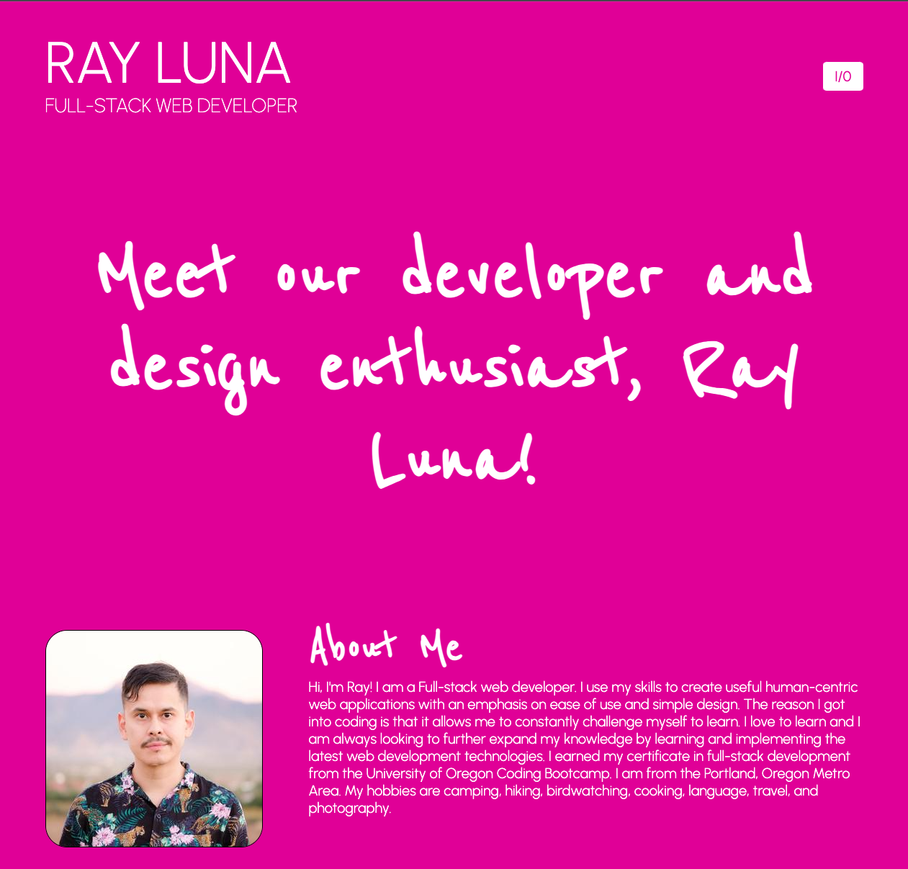

# Vanilla.js Portfolio

This is my web developer portfolio buiilt with Vanilla JavaScript, HTML and CSS. It contains my bio, a list of skills, featured projects, and contact information.

Site content is pulled from Sanity.io CMS and rendered dynamically with JavaScript. This updates the content automatically and keeps it up to date across all of my portfolio sites.

This was an early portfolio project orginally a static website built with HTML and MaterializeCSS.
Project URL: [https://vanillajs-portfolio-rldev.netlify.app/](https://vanillajs-portfolio-rldev.netlify.app/)

## Related Project
dev-cms: [https://github.com/leon-luna-ray/dev-cms/](https://github.com/leon-luna-ray/dev-cms/)

## Technologies

- CSS3
- HTML5
- JavaScript
- Netlify
- Sanity
- Vite.js

## Image

## Contact

Author: Ray Luna

If you have any questions about the repo, open an issue or contact me directly at:
- E-Mail: leon.luna.ray@gmail.com
- GitHub: [leon-luna-ray](https://github.com/leon-luna-ray)
