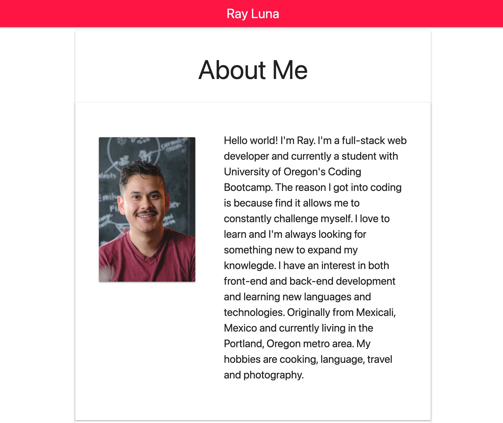

# Ray Luna: Portfolio

  ## Description

  Repository for my coding portfolio. It contains my bio, a list of featured projects and contact information.

  [rayluna.me](https://rayluna.me/) 

  ## Table of Contents

  * [Image](#image)
  * [Technologies](#technologies)
  * [Known-Bugs](#known-bugs)
  * [Next-Steps](#next-steps)
  * [License](#license)
  * [Contact](#contact)
  * [Links](#links)

  ## Image

  

  ## Technologies
  
  HTML,CSS

  ## Next-Steps

  Continue building functionality and styling.

  ## Contact

  Author: Ray Luna 

  If you have any questions about the repo, open an issue or contact me directly at:
  - E-Mail: leon.luna.ray@gmail.com
  - GitHub: [leon-luna-ray](https://github.com/leon-luna-ray)

  ## Links

  - [Portfolio](https://leon-luna-ray.github.io/portfolio/) 

  - [Project Repository](https://github.com/leon-luna-ray/portfolio)

  