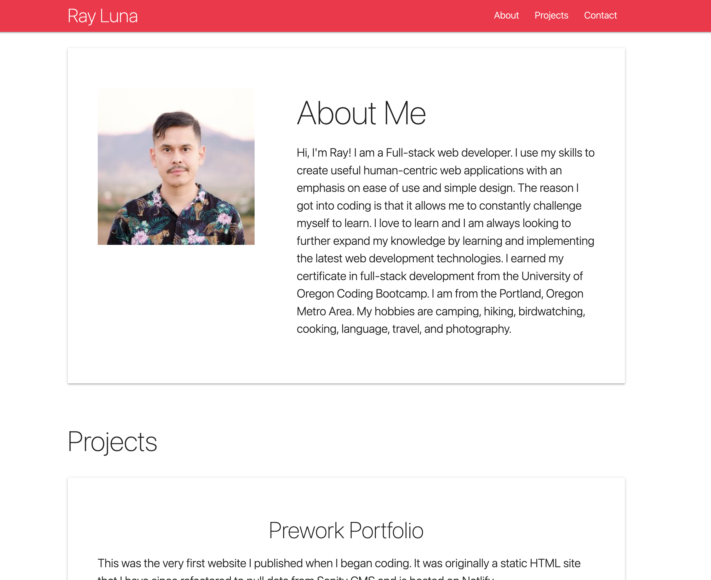

# Materialize Portfolio

This is an early portfolio project built with HTML and Materialize CSS. It contains my bio, a list of skills, featured projects, and contact information. Originally developed as a static HTML website. I refactored it to pull content from Sanity.io CMS and render HTML dynamically with vanilla JavaScript. This updates the content automatically and keeps it up to date.

Project URL: [https://materialize-portfolio-rldev.netlify.app/](https://materialize-portfolio-rldev.netlify.app/)

## Related Project
dev-cms: [https://github.com/leon-luna-ray/dev-cms/](https://github.com/leon-luna-ray/dev-cms/)

## Technologies

- JavaScript
- Vite.js
- HTML
- CSS
- Materialize CSS
- Sanity
- GROQ
- Netlify

## Image

## Contact

Author: Ray Luna

If you have any questions about the repo, open an issue or contact me directly at:
- E-Mail: leon.luna.ray@gmail.com
- GitHub: [leon-luna-ray](https://github.com/leon-luna-ray)
